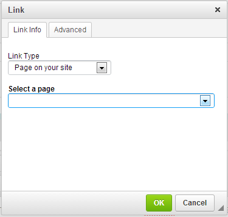

modxlink
========

CKEditor plugin for choosing MODX site page within Add Link dialog

Warning!
------------

This is *very* beta! The page list is slow (on large sites anyway), and there is probably a much better way to do it using the MODX cache. It would also be great to add a search function instead of a drop down list.

Instructions
------------

Add the modxlink folder to {modx_manager_path}/assets/components/ckeditor/plugins/

In MODX system settings, in CKEditor namespace, add modxlink to ckeditor.extra_plugins and update ckeditor.toolbar to replace Link with "Modxlink", e.g.

<pre>
{ "name": "links", "items": [ "Modxlink", "Unlink", "Anchor"] }
</pre>

You can still use the old way of adding page links using "URL" as link type, "Other" as protocol, and [[~{page id}]] as link target.